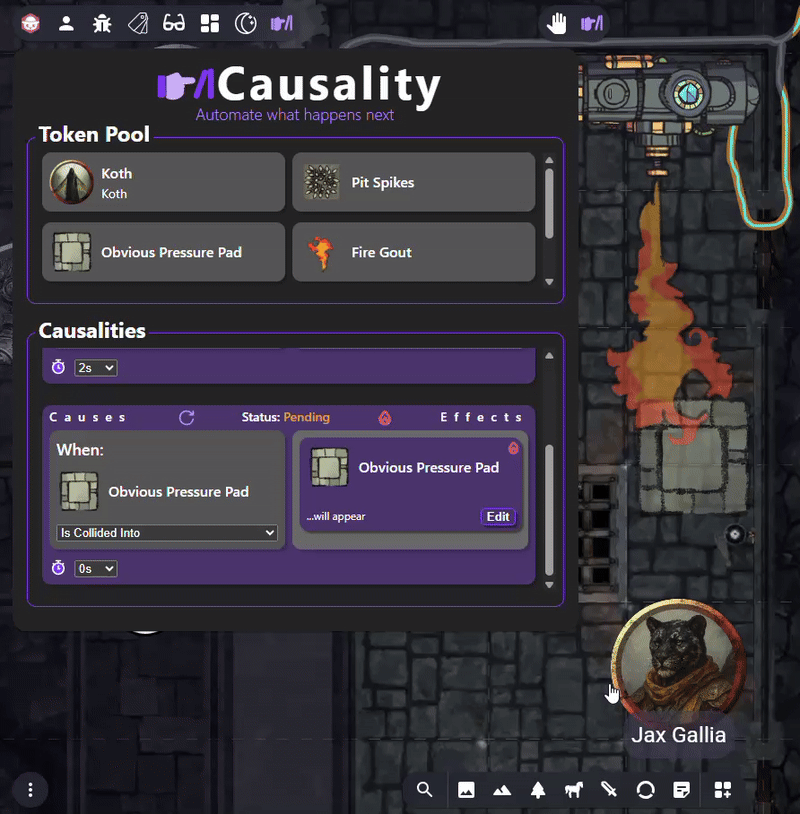
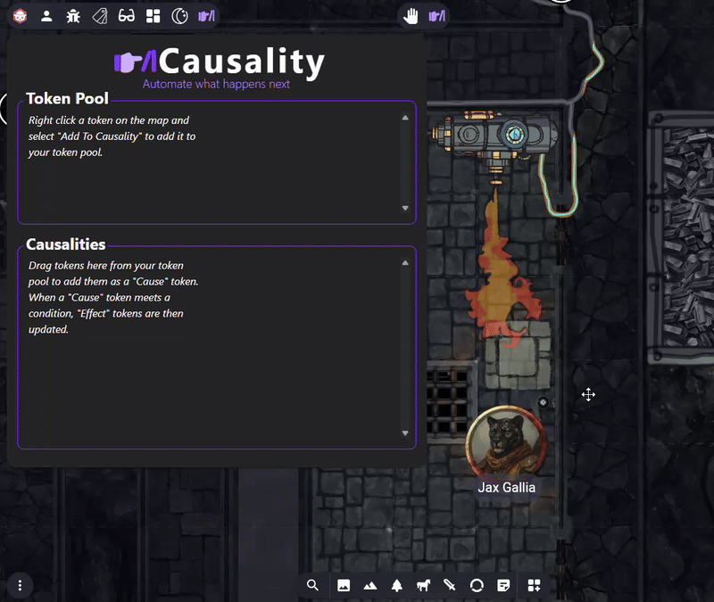
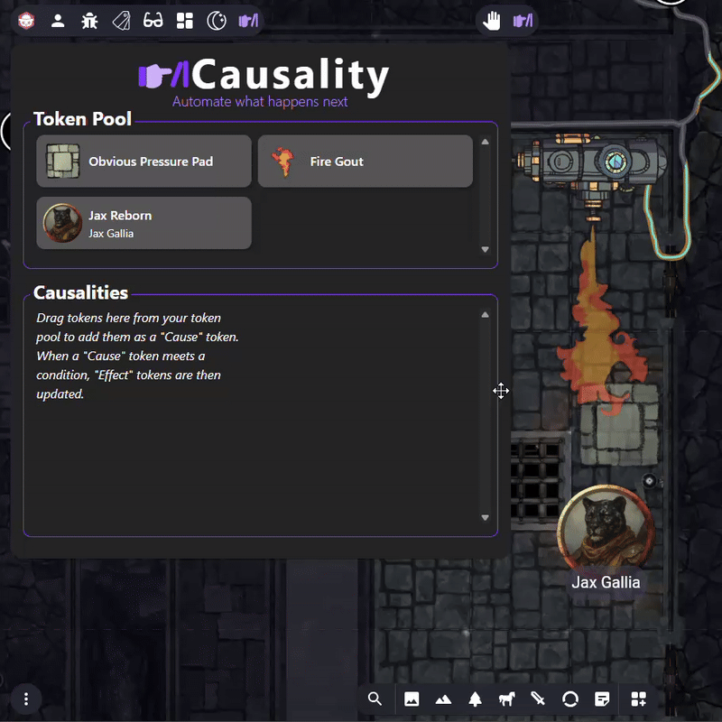
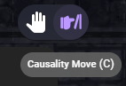

# Causality
### An an [Owlbear Rodeo](https://www.owlbear.rodeo/) extension for automating what happens next.

Causality allows the GM of a room to orchestrate **cause** and **effect** relationships between tokens interacting on the map.

## How to use:

### Step 1:
**Add tokens to Causality.**

### Step 2:
**Set a token as a "Cause"**

### Step 3:
**Pair one or more tokens as an "Effect" to that "Cause"**

### Step 4:
**Trigger the "Causality" - or chain more together!**

### Step 5:
**Trigger the causality (or causalities). Reset them to start over.**

**IMPORTANT**: You MUST be using the **Causality Move Tool** in order for collisions to trigger.

 
 

> ⚡⚡⚡⚡
> 
> Thanks for checking out **Causality**! I literally just made this because I wanted a way for hidden traps to appear automatically if one of my players moved their token into it. Now we have this. 🙃
>
> ⚡⚡⚡⚡
